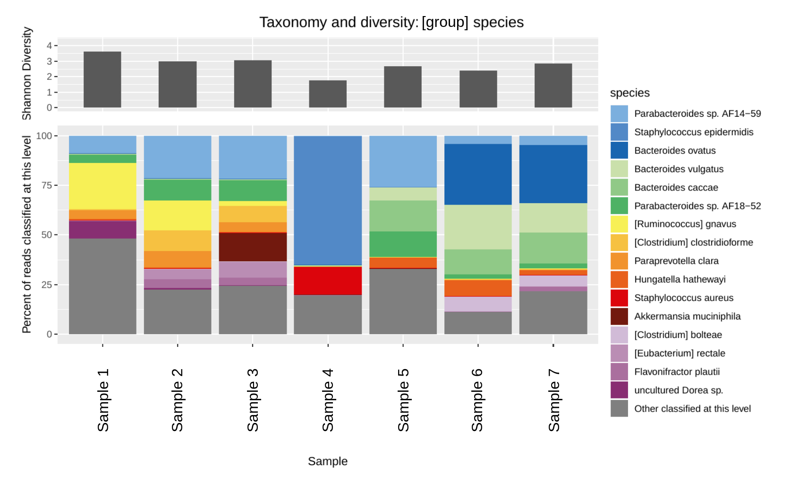
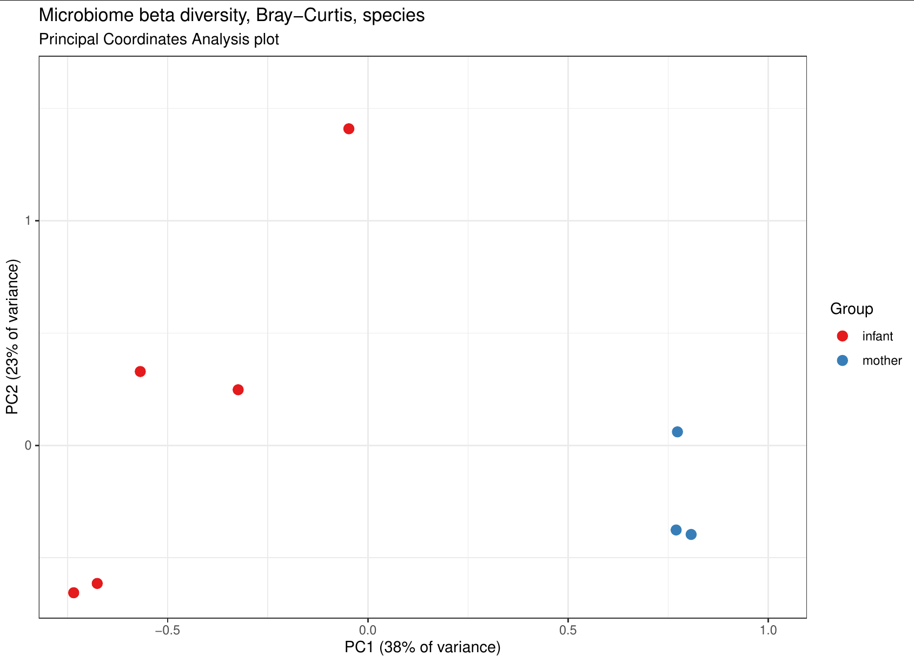

[](https://zenodo.org/badge/latestdoi/155569982)

# Kraken2 classification
A Snakemake pipeline wrapper of the Kraken2 short read metagenomic classification software, with additional tools for analysis, plots, compositional data and differential abundance calculation. Designed and maintained by Ben Siranosian in [Ami Bhatt's lab](http://www.bhattlab.com/) at Stanford University. 

## Introduction
[Kraken2](http://ccb.jhu.edu/software/kraken/) is a short read classification system that is fast and memory efficient. It assigns a taxonomic identification to each sequencing read, by using the lowest common ancestor (LCA) of matching genomes in the database. Using [Bracken](https://github.com/jenniferlu717/Bracken/) provides accurate estimates of proportions of different species. This guide will cover some of the basics, but the full [Kraken2 manual](http://ccb.jhu.edu/software/kraken/MANUAL.html) has much more detail.

## Table of contents
1. [Installation](manual/installation.md)
2. [Usage](manual/usage.md)
3. [Available databases](manual/databases.md)
4. [Downstream processing and plotting](manual/downstream_plotting.md)
5. [Additional considerations](manual/extra.md)
6. [Expanded database construction](manual/db_construction.md)
7. [Using metagenome assembled genomes as a database](manual/mag_db.md)
8. [GCTx data parsing](manual/gctx.md)

## Quickstart
### Install
If you're in the Bhatt lab, most of this work will take place on the SCG cluster. External users should set this pipeline up on their infrastructure of choice: cloud, HPC, or even a laptop will work for processing small datasets. You will have to [download or build a database](manual/db_construction.md), set the database options, and create the [sample input files](manual/usage.md). All steps of this pipeline are containerized, meaning only `snakemake` and `singularity` are required to run all tools.

If you're in the Bhatt lab, use [these instructions](https://github.com/bhattlab/bhattlab_workflows/blob/master/manual/setup.md) to set up snakemake and set up a profile to submit jobs to the SCG cluster. External users should follow these instructions:

1. [Install mambaforge](https://github.com/conda-forge/miniforge#mambaforge).
2. Create a fresh environment with `snakemake` or add it to an existing environment. Activate this environment for any step using this pipeline:
```
mamba create --name snakemake --channel conda-forge --channel bioconda snakemake
conda activate snakemake
```
3. [Install singularity](https://docs.sylabs.io/guides/latest/user-guide/quick_start.html#quick-installation-steps).

Then, clone this repo in a convenient location.
```
git clone https://github.com/bhattlab/kraken2_classification.git
cd kraken2_classification
```

### Run with test data
A Kraken2 database is required to use this pipeline. Pre-built database can be downloaded from [Ben Langmead's site](https://benlangmead.github.io/aws-indexes/k2). As an example, we download the standard database limited to 8GB memory use, and unpack it into a folder to use with the tests: 
```
cd kraken2_classification/tests
wget https://genome-idx.s3.amazonaws.com/kraken/k2_standard_08gb_20230605.tar.gz
mkdir db
tar -C db -xvf k2_standard_08gb_20230605.tar.gz
```

A small test dataset from [Yassour et. al (2018)](https://www.ncbi.nlm.nih.gov/pmc/articles/PMC6091882/) is included in this repo. 10,000 reads from several timepoints from a mother-infant pair are used. Even with such low coverage, the differences in microbiome composition are apparent in clustering and taxonomic barplots. Launch and end-to-end test run with a command like so: 
```
# Launch this from the kraken2_classification directory
snakemake -s Snakefile --configfile tests/test_config/config_pe.yaml -j1  --use-singularity
```

The script `tests/run_tests.sh` ensures basic functionality of the pipeline executes as expected. 

### Run with real-world data
Copy the `config.yaml` file into the working directory for your samples. Change the options to suit your project. The main input is the `sample_reads_file` which defines the mapping from sample names to sequencing reads. See [Usage](manual/usage.md) for more detail.

On the Bhatt lab SCG cluster, you can then launch the workflow with a snakemake command like so:
```
# Snakemake workflow - change options in config.yaml first
snakemake -s path/to/Snakefile --configfile config.yaml --use-singularity --singularity-args '--bind /oak/,/labs/,/home' --profile scg --jobs 99
```

If you're not in the Bhatt lab, a more general command should be sufficient, but you might need to add singularity bind arguments or a profile for SLURM job submission depending on your configuration. This example uses 8 cores, but that can be changed to reflect available resources.
```
snakemake -s path/to/Snakefile --configfile config.yaml --use-singularity --jobs 8 --cores 8
```

After running the workflow and you're satisfied the results, run the cleanup command to remove temporary files that are not needed anymore. 
```
snakemake cleanup -s path/to/Snakefile --configfile config.yaml
```

### Run analysis on existing data
If you have a collection of kraken/bracken reports and just want to run the downstream analysis in this pipeline, you can provide the `sample_reports_file` in the config, which is a map from sample names to kraken and bracken report files. See `tests/test_config/config_downstream_only_bracken.yaml` as an example. Then, launch the pipeline with `Snakefile_downstream_only`. Tune the filtering and job submission parameters to meet your needs.
```
snakemake -s Snakefile_downstream_only --configfile tests/test_config/config_downstream_only_bracken.yaml -j1  --use-singularity
```

## Parsing output reports
The Kraken reports `classification/sample.krak.report`, bracken reports `sample.krak_bracken.report`, and data matrices or GCTx objects in the `processed_results` folder are the best for downstream analysis. See [Downstream processing and plotting](manual/downstream_plotting.md) for details on using the data in R. 

## Example output
The pipeline outputs data, results and figures in the structure below. 
```
 | classification 
   - sample.krak                    Kraken results - classification of each read. These files
                                    can get very large and are unnecessary if you only want the reports. 
   - sample.krak.report             Kraken report - reads and percentages at each taxonomic level.
   - sample.krak.report.bracken     Standard bracken report at species level. Not useful, use the one below.
   - sample.krak_bracken.report     Most useful format of the the Bracken results.

 | processed_results
   - diversity.txt                  Diversity of each sample at each taxonomic level

   | ALDEX2_differential_abuncance  Compositional data analysis done with the ALDEx2 package.
                                    Only done if you have 2 groups in the sample_groups file.
     - aldex_result_[].tsv          Differential abundance at the given taxonomic level. 
     - aldex_scatter_[].pdf         Scatterplot of effect vs dispersion with significant hits highlighted
     - aldex_significant_boxplots_[].pdf  Boxplot of any significant hits

   | braycurtis_matrices
     - bravcurtis_distance_[].tsv   Matrix of braycurtis distance between samples at each taxonomic level
   
   | plots                          Lots of plots!
      - classified_taxonomy_barplot_[].pdf   Barplot at each taxonomic level.
      - compositional_PCA_plot.pdf  PCA done on clr values
      - diversity_allsamples.pdf    Diversity barplot
      - diversity_by_group.pdf      Diversity barplot, stratified by sample group
      - PCoA_2D_plot_labels.pdf     Principal coordinates analysis, calculated on braycurtis distances
      - PCoA_2D_plot_nolabels.pdf   Same as above without the point labels
      - rarefaction_curve.pdf       Rarefaction "collectors" curve plot

   | taxonomy_gctx_classified_only  
      - bracken_[]_reads.gctx       GCTx file with matrix containing reads classified at each level 
      - bracken_[]_percentage.gctx  Same, but percentage of classified reads

   | taxonomy_matrices_classified_only
      - bracken_[]_reads.txt        Matrix of taxa by sample classified reads
      - bracken_[]_percentage.txt   Same, but percentage of classified reads
      - clr_values_[].txt           From compositional data analysis, centered log-ratio values at each level

 | processed_results_krakenonly
   | Same as above, but using the results without Bracken. Also includes taxonomy matrices
   | that have unclassified reads in them (as bracken no longer reports unclassified reads)
 
 | unmapped reads
   - sample_unmapped_1.fq           Only present if selected in the config file; reads that are not 
   - sample_unmapped_2.fq           classified, as paired end fastq.
```

_Taxonomic barplot_


_PCoA plot example_


## Changelog

### 2023-06-07
v2.0 (Breaking changes introduced to to configuration files and the ways parameters are used). 
This set of changes did a bit to modernize the pipeline:
* All steps are now available with containerized execution
* Created separate pipeline `Snakefile_downstream_only` which works from a list of report files to only un the downstream analysis steps.
* Included a small test dataset and better test execution
* Various code and README/manual changes
* License file added

### 2019-09-01
The outputs of this pipeline have been vastly improved! Both internally and saved data now use the GCTx data format, from the [CMapR](https://github.com/cmap/cmapR) package. Basically, a GCT object is a data matrix that has associated row and column metadata. This allows for consistent metadata to live with the classification data, for both the rows (taxonomy information) and columns (sample metadata). See section [8. GCTx data processing](manual/gctx.md) for more information and tools for working with the new implementation. 

Also as of this update, the NCBI taxonomy information used by Kraken is filtered and improved some before saving any data or figures. For example, there were previously many taxonomy levels simply labeled "environmental samples" that are now named with their pared taxa name to remove ambiguity. Also, levels without a proper rank designation (listed with an abbreviation and a number in the kraken report) have been forced into a specific rank when nothing was below them. This makes the taxonomy "technically incorrect", but much more practically useful in these cases. Contact me with any questions. The full list of changes is described in [Additional considerations](manual/extra.md)
