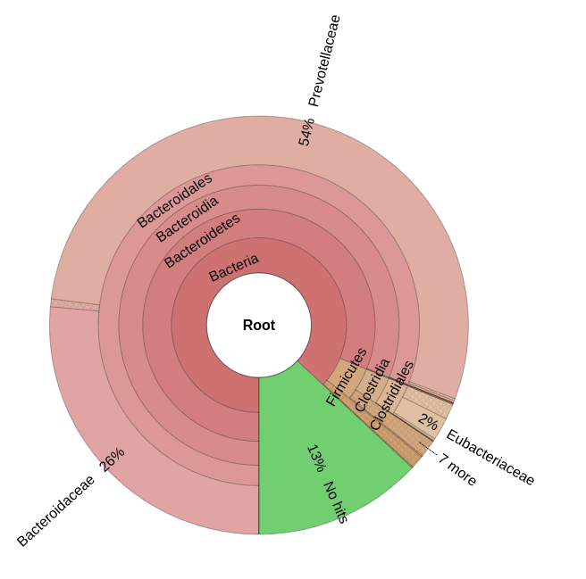
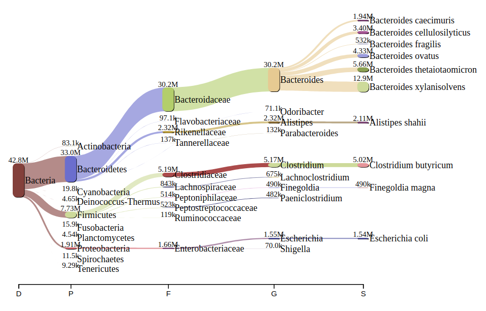
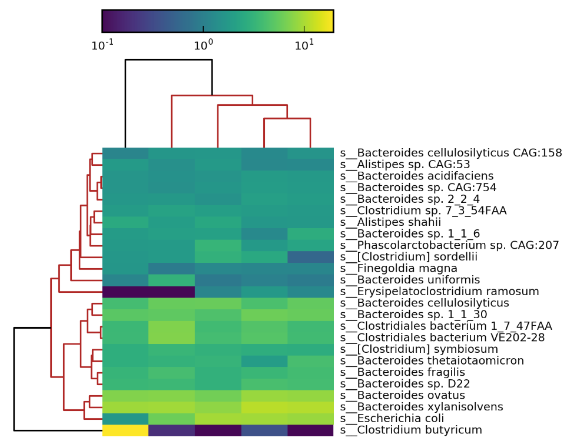

## Downstream processing

### Automatic pipeline outputs: 
See the main readme page for a description of the output files from the pipeline

### Abundance estimation with Bracken
[Bracken](https://peerj.com/articles/cs-104/) post-processes kraken outputs to (hopefully) make them more accurate.  

Due to Kraken's LCA reporting, clades with many similar species will only have species-level assignments for unique regions, leaving most reads "stranded" above the species level. The number of reads classified directly to a species may be far lower than the actual number present. Therefore, any assumption that Kraken’s raw read assignments can be directly translated into species- or strain-level abundance estimates is flawed, as ignoring reads at higher levels of the taxonomy will grossly underestimate some species, and creates the erroneous impression that Kraken’s assignments themselves were incorrect.Bracken (Bayesian Reestimation of Abundance after Classification with KrakEN) estimates species abundances in metagenomics samples by probabilistically re-distributing reads in the taxonomic tree. 
The [manual](https://ccb.jhu.edu/software/bracken/index.shtml?t=manual) has an explanation of the command line options.

#### Databases
There are databases built for 100 & 150bp reads in each of the db folders mentioned above. Just specify the same database you used for classification in the bracken command. If you have different read lengths, contact @bsiranosian (contributor to this repo) to build a DB or use the `bracken-build` command (use 32 cores for speed).

### Processing tables in R 
There's a script to load Kraken/Brakcen reports in R in the `scripts` folder of the main repo. You **MUST** use this if you want to load the data at different taxonomic levels. That's because some species in the NCBI taxonomy don't have a Genus above them (or other variations on this annoyance). Parsing a report solely at the Genus level will miss all the species if they only have a family classification, for example. This is the most common with viruses (crAssphage) and other weird organisms. I can write something similar for python, etc if there's demand for it. 

### Visualization with Krona
Krona is a great way to explore the taxonomic identifications and proportions. These reports are generated by the workflow by default, and located in `outputs/krona`.  Here is an example:



### Sample comparison with Pavian
[Pavian](http://ccb.jhu.edu/software/pavian/) is a web application fo comparing kraken classification results. I find it useful to visualize results across many samples. This application should be installed on your local machine in it's own conda environment. The [github repo](https://github.com/fbreitwieser/pavian) has installation instructions. I first have to run this option in R to work, then start the app: 
```
options(browser="google-chrome")
pavian::runApp()
```
Bracken reports can be used here as an input as well. Pavian also makes nice classification flowcharts, see below for an example:



### Metaphlan2 style heatmaps
If you want to make a heatmap like in those made in metaphlan2, you can use the `--use-mpa-style` option to get a compatable report. Normalize to the total number of classified reads at the domain level:
```
sum=$(grep -vP "\|" out.mpareport | cut -f 2 | awk '{sum += $1} END {printf ("%.2f\n", sum/100)}')
awk -v sum="$sum" 'BEGIN {FS="\t"} {OFS="\t"} {print $1,$2/sum}' out.mpareport > out.mpareport.norm

```
Then reports can be merged and plotted just like in metaphlan2 (you might need to remove the -c viridis option here):
```
merge_metaphlan_tables.py *.norm >  merge_metaphlan.txt
grep -E "(s__)|(^ID)"  merge_metaphlan.txt | grep -v "t__" | sed 's/^.*s__//g' >  merge_metaphlan_species.txt
metaphlan_hclust_heatmap.py --in merge_metaphlan.txt  --top 25 --minv 0.1 -s log --out merge_metaphlan_heatmap.png -f braycurtis -d braycurtis -c viridis 
metaphlan_hclust_heatmap.py --in merge_metaphlan.txt  --top 150 --minv 0.1 -s log --out merge_metaphlan_heatmap_big -f braycurtis -d braycurtis -c viridis
```

