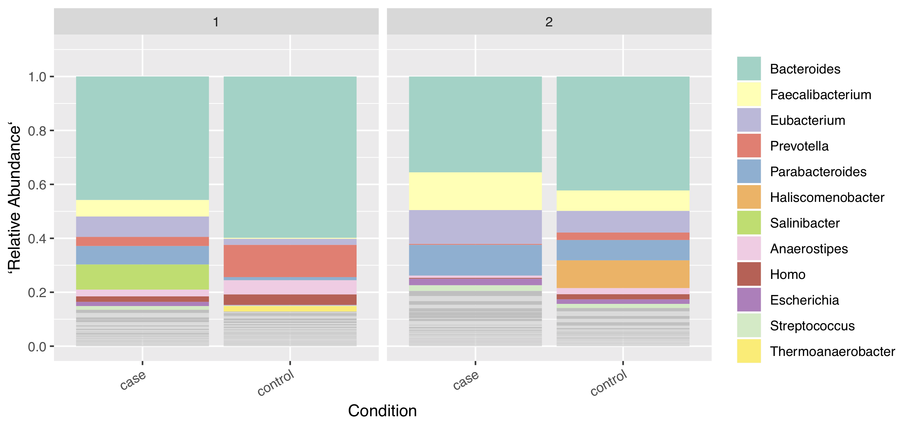

## Usage
Run the following in an interactive session, or submit it as a job.  Do not add `--profile scg` as is typically done with other workflows. By default, samples are classified using the high quality genbank database (see Databases section below) and postprocessed/visualized at the genus level. Edit the config.yaml file to change this behavior.

```
source activate classification2
snakemake -s path/to/Snakefile --configfile config.yaml
```
The database stays in memory after loading, so it's very quick to run many samples consecutively. This is why it is faster to run the workflow on a single node than parallelizing.

## Datasets table
The input data are specified in the form of a tab-delimited table taking the below form:
```
Sample  Timepoint   Condition   Reads1.fq[.gz][,Reads2.fq[.gz]]
a   1   control a_1.fq,a_2.fq
b   2   case    b_1.fq,b_2.fq
c   1   case    c_1.fq.gz,c_2.fq.gz
d   2   case    d_1.fq.gz,d_2.fq.gz
```

This yields a barplot that looks like this:


